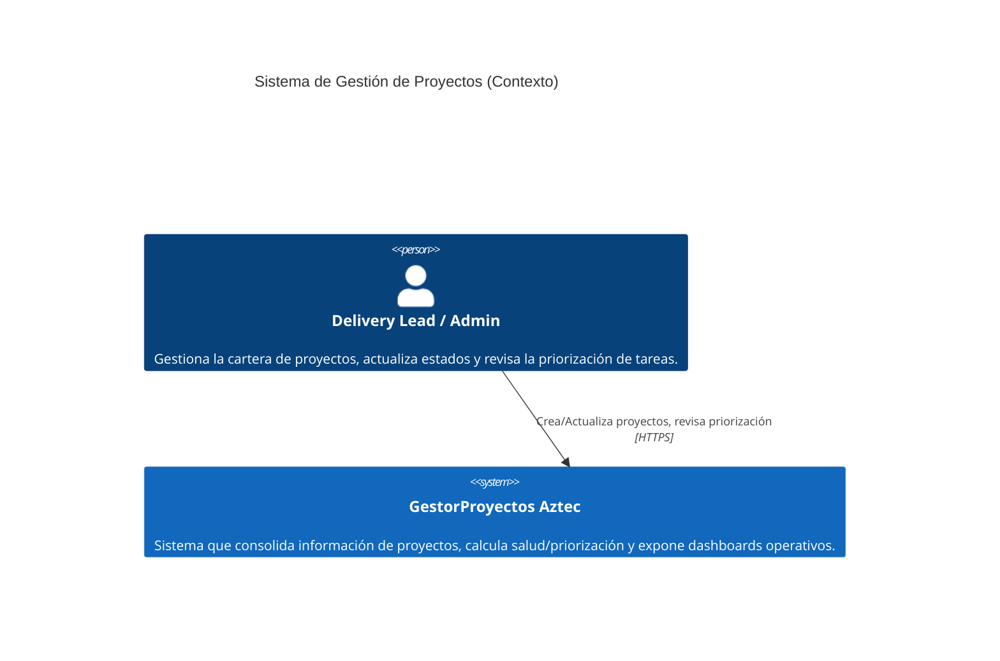
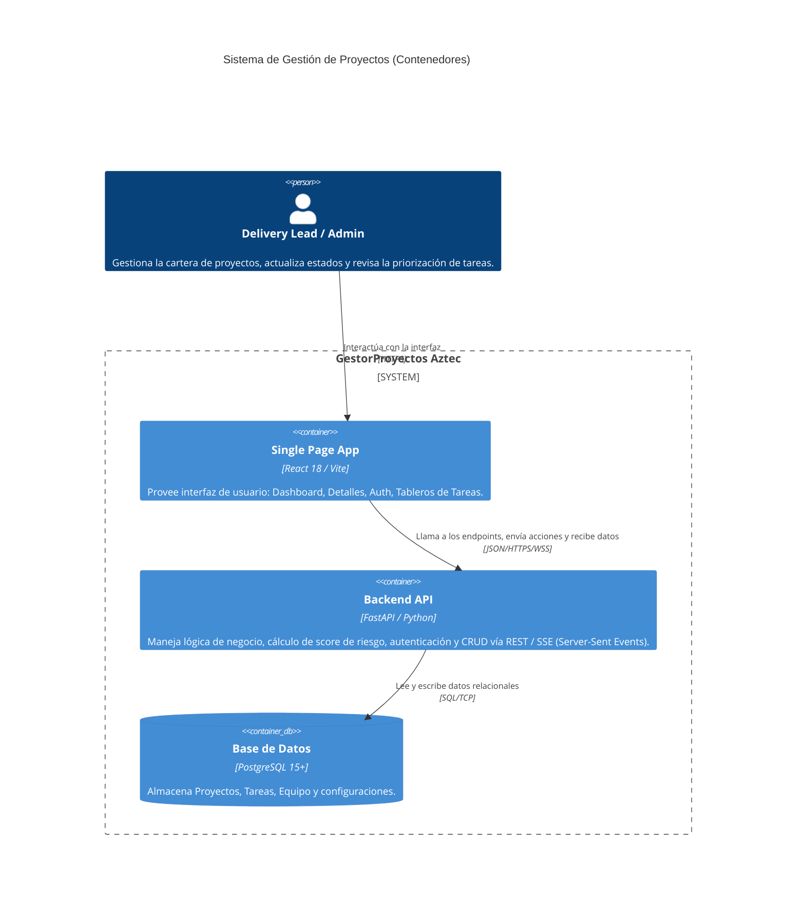
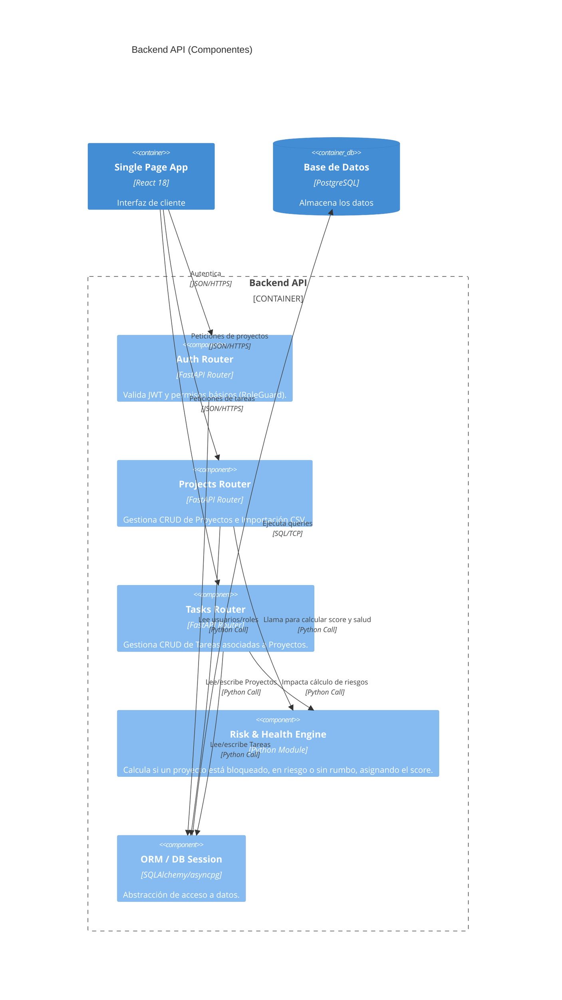

# Technical Discovery

## 1. Non-Functional Requirements (NFRs)
- **Rendimiento**: Soporte de ~20 proyectos y ~80 tareas con latencia < 200ms en operaciones de lectura/escritura (SPA con Zustand + FastAPI).
- **Disponibilidad/Despliegue**: Sistema empaquetado vía Docker y docker-compose para levantamiento local rápido.
- **Tolerancia a fallos (Carga de Datos)**: La importación de CSV es asíncrona vía BackgroundTasks y notifica progreso vía SSE. No debe bloquearse por filas malformadas; los errores parciales se envían por SSE para no colapsar la RAM del worker asíncrono (tamaño límite < 5MB).
- **Calidad de Código**: Cobertura de tests > 80%, reglas de linting estrictas (Ruff para backend, ESLint para frontend) evaluadas en CI.
- **Sincronización de Datos (Stretch Goal)**: Uso de SSE (Server-Sent Events) puras en React para reflejar cambios concurrentes. Si la conexión falla, se degrada a datos en memoria (estado Zustand) sin implementar ciclos de polling.

## 2. Integraciones y Datos
- **Fuente de Datos Inicial**: Sistema sin integraciones externas en MVP (No se integra API origen Aztec). Los datos semilla (Proyectos, Tareas, Equipo, Notas) provienen exclusivamente de los CSV proporcionados en `docs/00-requirements/`.
- **Base de Datos**: PostgreSQL 15+ local (dentro del docker-compose).

## 3. Seguridad
- **Autenticación**: Autenticación basada en tokens JWT.
- **Autorización (Roles Básicos)**: 
  - Backend valida claims de JWT.
  - Frontend usa un componente `RoleGuard` para bloquear renderizado de rutas de Admin/Settings a usuarios no autorizados (ej. no administradores).
- **Protección de Datos**: Criterio de aislamiento de tenant/cliente NO requerido para esta versión.

## 4. Stack Tecnológico (Pre-definido por Producto)
- **Frontend**: React 18, TypeScript, Vite, Zustand (estado), Vanilla CSS (estilos).
- **Backend**: FastAPI (Python), PostgreSQL 15+.
- **Infraestructura**: Docker + docker-compose.

# Arquitectura C4 y Stack Tecnológico

## 1. Stack Tecnológico Seleccionado
Dado el PRD y el Tech Discovery, el stack es:
- **Frontend**: React 18 (SPA), TypeScript, Vite.
  - **Estado**: Zustand (gestión minimalista, sin boilerplate).
  - **Estilos**: Vanilla CSS.
- **Backend**: FastAPI (Python) - asíncrono, con validación automática y generación de Swagger.
- **Base de Datos**: PostgreSQL 15+ para integridad relacional.
- **Infraestructura Local**: Docker y docker-compose.

## 2. Diagramas C4 (Mermaid)

### 2.1 C4 - Contexto (Nivel 1)
Describe el sistema en su entorno y quién lo utiliza.

### 2.2 C4 - Contenedor (Nivel 2)
Muestra las partes principales del sistema y su responsabilidad.

### 2.3 C4 - Componente (Nivel 3) - Backend API
Muestra los módulos internos clave de la API.

## 3. Decisiones Arquitectónicas Principales (A ser elaboradas en ADRs)
1. **Zustand para gestión de estado de cliente** en lugar de Redux o Context API simple.
2. **FastAPI como servidor API** para aprovechamiento del tipado estricto (Pydantic) y velocidad de desarrollo asíncrono.
3. **Persistencia del Risk Engine en BD** en lugar de calcularlo on-the-fly, para evitar N+1 queries en listados mediante triggers o eventos de aplicación.
4. **Autenticación con JWT** y persistencia en PostgreSQL con SQLAlchemy 2.0 (Async).\n5. **SSE sin fallback** para interactividad real-time en UI (mostrar indicador Offline si falla).\n6. **Carga asíncrona** de CSV con BackgroundTasks.\n7. **Motor polimórfico** (Strategy) para score de prioridad.\n8. **Infraestructura** Single-Node Docker Compose (best-effort SLA).

# PRD Técnico � GestorProyectos

## 1. Resumen Ejecutivo
Este documento consolida las decisiones de arquitectura, especificaciones técnicas y requerimientos no funcionales (NFRs) para la construcción de **GestorProyectos Aztec**, sirviendo como contrato técnico para la etapa de desarrollo.

## 2. Referencias a Artefactos
- **PRD de Producto**: `docs/01-prd/gestor-proyectos-aztec.md`
- **Technical Discovery**: `docs/02-architecture/blueprint.md`
- **Arquitectura C4**: `docs/02-architecture/blueprint.md`
- **ADRs (Architecture Decision Records)**:
  - `docs/02-architecture/adrs/001-fastapi-backend.md`
  - `docs/02-architecture/adrs/002-frontend-stack.md`
  - `docs/02-architecture/adrs/003-dynamic-risk-engine.md`
  - `docs/02-architecture/adrs/004-jwt-auth.md`

## 3. Stack Tecnológico Final
- **Frontend**: React 18, TypeScript, Vite.
- **Gestor de Estado**: Zustand.
- **Estilos**: Vanilla CSS.
- **Backend API**: FastAPI (Python) nativo asíncrono.
- **Base de Datos**: PostgreSQL 15+.
- **Despliegue/Contenedorización**: Docker + docker-compose (ambiente local y demo).

## 4. Requisitos No Funcionales (NFRs) Implementables
1. **Rendimiento**: Motor de riesgo persistido en BD. Las lecturas en los listados usarán agregaciones SQL o campos desnormalizados para evitar N+1 queries al cargar ~20 proyectos y sus ~80 tareas.
2. **Resiliencia**: Tolerancia a fallos parciales durante la ingesta del dataset (CSV semilla) vía endpoint. Registros malformados devuelven array de errores sin frenar transacciones válidas. Durante la ingesta de `Team.csv`, se asocian roles dinámicamente a la tabla User.
3. **Seguridad**:
   - Endpoints backend protegidos con JWT Completo y hashing Argon2id.
   - SPA frontend controlada por `RoleGuard` según el rol decodificado del usuario.
4. **Interactividad**: SSE (Server-Sent Events) puras para actualización en tiempo real del tablero de seguimiento (sin fallback a polling).

## 5. Diseño de Base de Datos (Esquema Alto Nivel)
- **User**: `id, name, email, role, password_hash`
- **Project**: `id, code, title/name, client, engagement_type, project_type, stage, status, health, owner, owner_role, target_date/deadline, business_value, currency, blockers, next_step, summary, open_tasks, overdue_tasks, priority_strategy, priority_constant, created_at, updated_at`
- **Task**: `id, project_id (FK), code, title, detail, assignee, assignee_role, priority, status, due_date, is_overdue, dependency, last_progress, created_at, updated_at`
- **TeamMember**: `id, name, role, is_active, created_at, updated_at`
- **AuditLog**: `id, project_id, entity_type, entity_id, action, old_value (JSONB), new_value (JSONB), changed_by, changed_at`
- **ProjectTemplate**: `id, name, description, structure (JSONB), created_at`
- **WebhookDelivery**: `id, webhook_id, event, payload (JSONB), status, attempt_count, created_at`

## 6. Siguientes Pasos
- Proceder con la vertical de Construcción (`/factory-build-flujo` o equivalentes).
- Iniciar levantamiento de esqueleto en repositorio según C4-Componentes definidos.
- Integración de los datos en CSV mediante script inicial.

