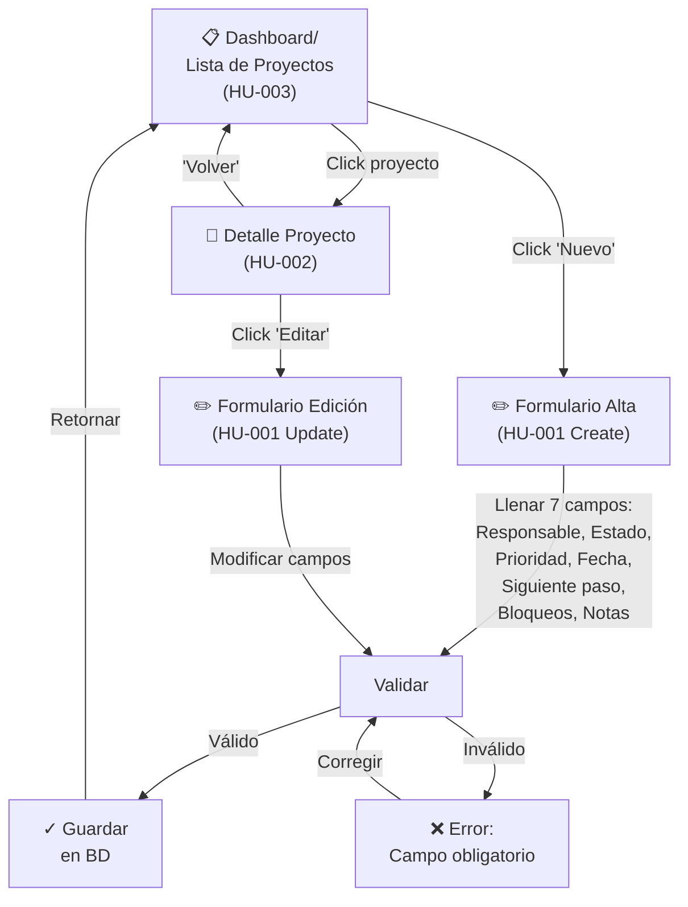

# EP-001 — Flujos de Navegación: CRUD de Proyectos

## Trazabilidad

**Épica**: EP-001 — Gestión de Proyectos (CRUD)  
**Historias cubiertas**: HU-001 (Crear/Actualizar), HU-002 (Consultar), HU-003 (Listar), HU-020 (Eliminar), HU-022 (Edición inline)  
**Descripción**: Flujos de navegación para operaciones CRUD completas sobre proyectos. Cubre alta, consulta, listado, eliminación y edición rápida.

## Diagrama Principal

## Escenarios de Flujo

### Escenario 1: Crear Proyecto Nuevo (HU-001 Create)
1. Usuario en Dashboard (A) hace clic en "Nuevo Proyecto"
2. Se abre Formulario Alta (C)
3. Llena los 7 campos: responsable, estado, prioridad, fecha_límite, siguiente_paso, bloqueos, notas
4. Presiona "Guardar"
5. Sistema valida (todos campos requeridos)
6. Se crea el proyecto en BD
7. Vuelve a Dashboard, proyecto aparece en la lista

### Escenario 2: Editar Proyecto Existente (HU-001 Update)
1. Usuario en Dashboard (A) hace clic en un proyecto
2. Se abre Detalle (B), mostrando valores actuales
3. Usuario hace clic en "Editar"
4. Se abre Formulario Edición (D) pre-llenado
5. Modifica uno o más campos
6. Presiona "Guardar"
7. Se actualiza en BD
8. Retorna a Dashboard (A), proyecto muestra valores nuevos

### Escenario 3: Consultar Proyecto (HU-002)
1. Usuario en Dashboard (A)
2. Hace clic en un proyecto
3. Se abre Detalle (B) en modo lectura (solo visualización)
4. Puede ver los 7 campos
5. Desde aquí puede hacer clic en "Editar" → flujo de edición (Escenario 2)
6. O "Volver" para retornar al Dashboard

### Escenario 4: Listar con Filtros (HU-003)
1. Usuario en Dashboard (A)
2. Ve filtros: [Estado ▼] [Responsable ▼] [Otros...]
3. Selecciona filtro (ej: estado="Activo")
4. Lista se actualiza mostrando solo proyectos Activos
5. Puede aplicar múltiples filtros simultáneamente
6. Puede limpiar filtros → vuelve a lista completa

---

## Validaciones en Flujo

| Punto | Validación | Acción en Fallo |
|---|---|---|
| Crear/Editar | Campo "responsable" no vacío | Mostrar error, mantener en formulario |
| Crear/Editar | Campo "estado" seleccionado | Mostrar error, mantener en formulario |
| Crear/Editar | "fecha_límite" es fecha válida (si se completa) | Mostrar error de formato |
| Filtrar | Filtro seleccionado existe | Ignorar silenciosamente, aplicar otros |

---

## Puntos de Integración

- **Hacia EP-002 (Salud)**: Cuando se crea/actualiza un proyecto, el sistema calcula automáticamente su `health` (bloqueado/riesgo/sin rumbo/ok). Este campo influye en la ordenación de EP-003.
- **Hacia EP-004 (Tareas)**: Desde Detalle (B) puede haber un botón "Ver tareas" que lleve a la lista de tareas del proyecto.
- **Hacia EP-005 (Carga)**: Los datos iniciales vienen del CSV, pero CRUD manual sigue siendo el flujo para ediciones posteriores.
