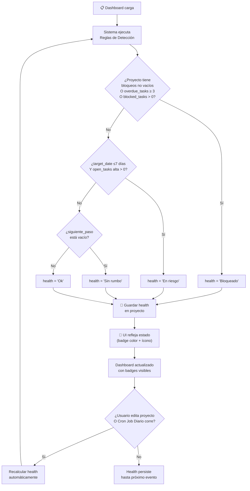

# EP-002 — Flujos de Navegación: Motor de Detección de Salud

## Trazabilidad

**Épica**: EP-002 — Motor de Detección de Salud  
**Historias cubiertas**: HU-004 (Detectar Bloqueado), HU-005 (Detectar Riesgo), HU-006 (Detectar Sin Rumbo)  
**Descripción**: Reglas automáticas para clasificar la salud de proyectos. Evalúa bloqueos, urgencia y estado de siguiente paso.

## Diagrama Principal



## Escenarios de Flujo

### Escenario 1: Detección de "Bloqueado" (HU-004)
1. Sistema carga un proyecto con `blockers="Espera aprobación legal"`
2. Ejecuta regla: ¿blockers no vacío?
3. Sí → health = "Bloqueado"
4. Badge visual muestra 🚫 Bloqueado (rojo)
5. Usuario ve en Dashboard que el proyecto está bloqueado

### Escenario 2: Detección de "En riesgo" (HU-005)
1. Sistema carga un proyecto con target_date="2026-08-05" (6 días)
2. Cuenta open_tasks con priority="Alta" → 2 tareas
3. Ejecuta regla: ¿target_date ≤7 días Y open_tasks alta > 0?
4. Sí → health = "En riesgo"
5. Badge muestra ⚠️ En riesgo (ámbar)

### Escenario 3: Detección de "Sin rumbo" (HU-006)
1. Sistema carga un proyecto con siguiente_paso=""
2. Verifica regla: ¿siguiente_paso está vacío?
3. Sí → health = "Sin rumbo"
4. Badge muestra ❓ Sin rumbo (gris)

### Escenario 4: Proyecto "Ok"
1. Sistema carga un proyecto que:
   - blockers="" (vacío)
   - overdue_tasks < 3
   - target_date > 7 días O open_tasks alta = 0
   - siguiente_paso="Revisar con cliente"
2. Ejecuta todas las reglas
3. Ninguna se cumple → health = "Ok"
4. Badge muestra ✅ Ok (verde)

### Escenario 5: Cambio de Estado tras Edición
1. Proyecto inicialmente muestra health="Ok"
2. Usuario edita el proyecto vía EP-001
3. Agrega blokers="Nueva dependencia detectada"
4. Presiona "Guardar"
5. Sistema recalcula health automáticamente
6. health → "Bloqueado"
7. Dashboard se actualiza, badge cambia a 🚫 sin que el usuario recargue

---

## Reglas de Cálculo (Referencia)

```
SI blockers ≠ "" O overdue_tasks ≥ 3 O blocked_tasks > 0
  ENTONCES health = "Bloqueado"
  
SINO SI target_date ≤ hoy + 7 días Y critical_tasks_count (tareas abiertas prioridad Alta) > 0
  ENTONCES health = "En riesgo"
  
SINO SI siguiente_paso = ""
  ENTONCES health = "Sin rumbo"
  
SINO
  health = "Ok"
```

---

## Puntos de Integración

- **Desde EP-001 (CRUD) y Cron Job**: Cuando un proyecto se crea/edita, O cuando el Cron Job diario se ejecuta (verificando fechas vencidas), se recalcula el `health` de forma determinista.
- **Hacia EP-003 (Vista)**: El `health` es uno de los factores en el score de priorización (weight 0.3).
- **Hacia EP-004 (Tareas)**: Los campos `open_tasks` y `overdue_tasks` se sincronizan desde la tabla de tareas. Si una tarea se marca como resuelta, el contador baja, y el `health` se recalcula.
- **Independencia**: El motor de salud es determinista y no depende de la UI; calcula en backend.
