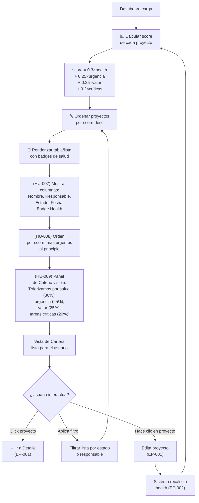

# EP-003 — Flujos de Navegación: Vista de Cartera y Priorización

## Trazabilidad

**Épica**: EP-003 — Vista de Cartera y Criterio de Priorización  
**Historias cubiertas**: HU-007 (Vista con badges), HU-008 (Ordenar por score), HU-009 (Panel configuración), HU-023 (Panel explicativo), HU-026 (Frontend dockerizado)  
**Descripción**: Dashboard de cartera ordenado por score de priorización. Visualiza salud con badges, explica criterio, permite configuración de estrategia, y corre en container Docker.

## Diagrama Principal



## Escenarios de Flujo

### Escenario 1: Vista de Cartera con Badges (HU-007)
1. Usuario accede al Dashboard
2. Sistema calcula `health` para cada proyecto (EP-002)
3. Renderiza tabla con columnas:
   - Nombre (proyecto)
   - Responsable
   - Estado
   - Fecha límite
   - **Badge de health** (🚫 Bloqueado en rojo, ⚠️ En riesgo en ámbar, ❓ Sin rumbo en gris, ✅ Ok en verde)
4. Usuario ve de un vistazo qué problemas hay
5. Puede hacer clic en un proyecto para ver detalles

### Escenario 2: Ordenación por Score (HU-008)
1. Sistema calcula score para cada proyecto:
   ```
   score = 0.3 × health_factor
         + 0.25 × (1 - days_to_deadline/365)  // cercano a deadline = más urgente
         + 0.25 × business_value/10
         + 0.2 × critical_tasks_count (tareas abiertas prioridad Alta)/max_tasks
   ```
2. Ordena lista en orden descendente (mayor score primero)
3. **Ejemplo**:
   - Proyecto A: health=Bloqueado(0.3), urgencia=6d(0.8), valor=9(0.9), críticas=2(0.8) → **0.776**
   - Proyecto B: health=Ok(0), urgencia=30d(0.2), valor=5(0.5), críticas=0(0) → **0.167**
   - Proyecto C: health=En riesgo(0.15), urgencia=5d(0.85), valor=8(0.8), críticas=1(0.4) → **0.538**
   - **Orden**: A (0.776) > C (0.538) > B (0.167)
4. Usuario ve Proyecto A primero (más urgente atender)

### Escenario 3: Panel Explicativo del Criterio (HU-009)
1. Usuario en Dashboard ve un panel/sección que dice:
   ```
   "¿Cómo priorizamos?
   Salud (30%): Proyectos bloqueados o en riesgo se priorizan.
   Urgencia (25%): Fechas límite próximas suben en la lista.
   Valor (25%): Importancia estratégica del proyecto.
   Tareas Críticas (20%): Cuántas tareas urgentes tiene pendiente.
   
   El score combina estos factores para decirte qué atender primero.
   Ver fórmula completa →"
   ```
2. Usuario entiende por qué un proyecto está en cierta posición
3. Puede expandir "Ver fórmula completa" para ver el cálculo exacto

### Escenario 4: Filtrado de Cartera (Interacción)
1. Usuario en Dashboard ve filtros: [Estado ▼] [Responsable ▼]
2. Selecciona estado="Activo"
3. Lista se filtra (solo proyectos Activos)
4. **Pero**: El score sigue ordenando dentro del filtro
5. Usuario ve solo Activos, ordenados por prioridad

### Escenario 5: Cambio de Score tras Edición
1. Usuario ve Proyecto X en posición #5 en la lista
2. Hace clic, lo edita (EP-001), cambia fecha_límite a 2 días
3. Presiona Guardar
4. Sistema recalcula `health` (EP-002) → "En riesgo"
5. Sistema recalcula `score` (urgencia sube)
6. Vuelve a Dashboard
7. Proyecto X está ahora en posición #2 (sube en la prioridad)

---

## Fórmula de Score (Detallada)

```python
# Patrón Strategy (Motor Polimórfico - ADR 007)
def calculate_score(project):
    strategy = project.priority_strategy # 'relative', 'absolute', 'mixed'
    
    if strategy == 'absolute':
        return project.priority_constant
        
    elif strategy == 'relative':
        return calculate_urgency(project.target_date) * project.business_value
        
    elif strategy == 'mixed':
        health_weight = 0.3
        urgency_weight = 0.25
        value_weight = 0.25
        critical_weight = 0.2
        
        health_score = get_health_score(project.health)
        urgency_score = calculate_urgency(project.target_date)
        
        return (health_score * health_weight) + (urgency_score * urgency_weight) + (project.business_value * value_weight) + (project.critical_tasks_count * critical_weight)
```
Nota: La configuración de la estrategia se lee directamente de la tabla `Project` (campos `priority_strategy`, `priority_constant`).

---

## Puntos de Integración

- **Desde EP-002 (Salud)**: El factor `health` contribuye 30% del score.
- **Desde EP-004 (Tareas)**: El contador de `critical_tasks` se actualiza cuando se cargan o editan tareas.
- **Hacia EP-001 (CRUD)**: Usuario puede hacer clic en proyecto para editarlo, luego regresa y ve orden actualizado.
