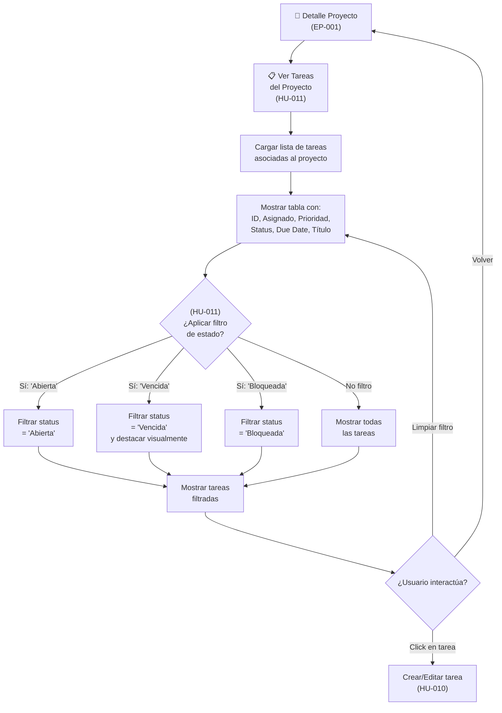

# EP-004 — Flujos de Navegación: Tareas por Proyecto

## Trazabilidad

**Épica**: EP-004 — Gestión de Tareas por Proyecto  
**Historias cubiertas**: HU-010 (Crear/Editar tareas), HU-011 (Filtrar tareas por estado)  
**Descripción**: Visualización y filtrado de tareas asociadas a un proyecto. Permite ver tareas por estado (abierta, vencida, bloqueada).

## Diagrama Principal

## Escenarios de Flujo

### Escenario 1: Ver Tareas de un Proyecto (HU-011)
1. Usuario en Detalle de Proyecto (desde EP-001)
2. Hace clic en sección "Tareas" o botón "Ver tareas"
3. Sistema carga la lista de tareas asociadas:
   - task_code, assignee, priority, status, due_date, title
4. Renderiza tabla mostrando todas las tareas
5. Si el proyecto tiene 0 tareas, muestra "No hay tareas asociadas"

### Escenario 2: Filtrar Tareas por Estado (HU-011)
1. Usuario ve la tabla de tareas
2. Aplica filtro [Estado ▼] seleccionando "Abierta"
3. Sistema filtra: muestra solo tareas con status="Abierta"
4. Otras opciones:
   - "Vencida": status="Vencida" (también destacadas en color rojo/ámbar)
   - "Bloqueada": status="Bloqueada" (tienen una dependencia no resuelta)
   - "Cerrada": status="Cerrada" (opcional, tareas completadas)

### Escenario 3: Borde - Proyecto con Muchas Tareas
1. Proyecto tiene 50+ tareas
2. Usuario abre la vista de tareas
3. Sistema pagina o virtualiza la lista (scroll eficiente)
4. El filtro sigue funcionando en toda la lista
5. Usuario puede buscar o filtrar sin lag

### Escenario 4: Tareas Vencidas con Indicador Visual
1. Usuario ve tabla de tareas
2. Una tarea tiene due_date="2026-07-20" (pasado) y status="Abierta"
3. Sistema marca `is_overdue=true`
4. Row de la tarea aparece con:
   - Fondo rojo o borde rojo
   - Ícono ⚠️ u otro indicador visual
5. Si Usuario aplica filtro "Vencida", esta tarea aparece en la lista filtrada

### Escenario 5: Sincronización Automática
1. Usuario en vista de tareas de Proyecto X
2. Otra pestaña/usuario edita una tarea y la marca como "Cerrada"
3. (Vía SSE): la fila se actualiza o desaparece del filtro "Abierta"
4. Si estaban viendo todas las tareas, la cuenta baja automáticamente
5. El contador `open_tasks` del proyecto se actualiza → `health` se recalcula (EP-002)

---

## Puntos de Integración

- **Desde EP-001 (CRUD)**: Detalle de Proyecto tiene acceso a esta vista.
- **Desde EP-002 (Salud)**: Los campos `open_tasks` y `overdue_tasks` se sincronizan. Cuando se actualiza una tarea aquí, el `health` del proyecto se recalcula automáticamente.
- **Desde EP-005 (Carga)**: Las tareas iniciales vienen del CSV importado.
- **Hacia EP-004 (Edición)**: Crear/editar tareas directamente (MUST, incluido en MVP, lectura y escritura - HU-010).

---

## Estados de Tarea (Referencia)

| Estado | Color | Ícono | Incluye en Contador |
|---|---|---|---|
| **Abierta** | Azul | 🔵 | open_tasks |
| **Vencida** | Rojo | ⚠️ | overdue_tasks |
| **Bloqueada** | Naranja | 🚫 | open_tasks + overhead |
| **Cerrada** | Verde | ✅ | Ninguno |
