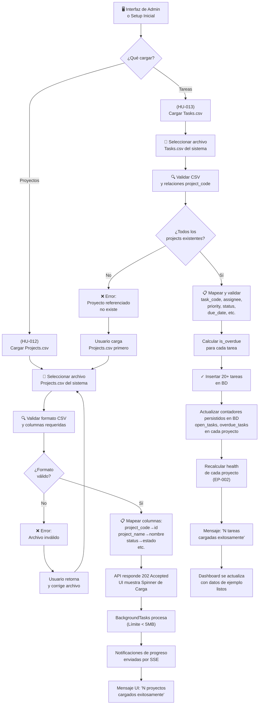

# EP-005 — Flujos de Navegación: Carga de Datos Semilla

## Trazabilidad

**Épica**: EP-005 — Carga de Datos Semilla (dataset Aztec)  
**Historias cubiertas**: HU-012 (Cargar proyectos desde CSV), HU-013 (Cargar tareas desde CSV), HU-014 (Cargar equipo desde CSV)  
**Descripción**: Importación asíncrona de datos de ejemplo desde archivos CSV. Incluye validación, mapeo de columnas, feedback en tiempo real vía SSE.

## Diagrama Principal



## Escenarios de Flujo

### Escenario 1: Carga de Proyectos (HU-012)
1. Usuario accede a pantalla de Admin/Setup
2. Hace clic en "Importar Proyectos"
3. Selecciona el archivo `Projects.csv` (del dataset Aztec)
4. Sistema valida:
   - Es un CSV válido
   - Tiene columnas: project_code, project_name, client_alias, status, owner_alias, target_date, business_value, etc.
5. Sistema mapea:
   - project_code → id único
   - project_name → nombre de proyecto
   - status → estado
   - owner_alias → responsable
   - target_date → fecha_límite
   - etc.
6. API devuelve 202 Accepted inmediatamente y lanza BackgroundTasks (límite CSV < 5MB).
7. UI muestra un Spinner de Carga.
8. Backend emite eventos SSE informando progreso y errores parciales.
9. Al finalizar, UI oculta Spinner y muestra: "✓ 15 proyectos cargados exitosamente".
10. Dashboard se actualiza en tiempo real vía SSE.

### Escenario 2: Carga de Tareas (HU-013)
1. Usuario hace clic en "Importar Tareas"
2. Selecciona archivo `Tasks.csv`
3. Sistema valida:
   - Es un CSV válido
   - Cada tarea tiene project_code que corresponde a un proyecto existente
4. Si hay una tarea referenciando un proyecto inexistente:
   - Error: "Proyecto 'P-999' no existe para tarea T-042"
   - Usuario debe cargar proyectos primero
5. Si OK:
   - Sistema mapea task_code, assignee, priority, status, due_date, etc.
   - Calcula `is_overdue` (si due_date < hoy)
   - Inserta 20+ tareas
6. **Actualiza contadores automáticamente**:
   - Proyecto P-001 tenía open_tasks=0, ahora tiene open_tasks=5
   - Recalcula `health` (EP-002)
7. Muestra: "✓ 25 tareas cargadas exitosamente"
8. Dashboard se actualiza: proyectos ahora tienen badges de salud (Bloqueado, En riesgo, etc.)

### Escenario 3: Borde - Reimportar Datos
1. Usuario intenta cargar Projects.csv nuevamente
2. Sistema detecta project_code duplicados
3. Opciones:
   - A) Rechazar la carga: "Ya existen estos proyectos"
   - B) Actualizar los existentes: "Overwrite mode"
4. Usuario elige la estrategia

### Escenario 4: Flujo Completo de Setup (One-Shot)
1. App instalada, BD vacía
2. Usuario abre pantalla de Admin
3. Carga Projects.csv → 15 proyectos
4. Carga Tasks.csv → 25 tareas
5. Sistema:
   - Sincroniza contadores (open_tasks, overdue_tasks)
   - Recalcula health para cada proyecto
   - Calcula scores de priorización
6. Usuario va a Dashboard
7. Ve cartera completa con:
   - 15 proyectos ordenados por prioridad
   - Badges de salud visibles
   - Proyectos con distintos estados y prioridades (como en el reto)

### Escenario 5: Validación de Data Integrity
1. Después de importar, usuario navega el Dashboard
2. Puede verificar:
   - Cada proyecto muestra sus tareas asociadas (EP-004)
   - Contador de open_tasks coincide con tareas "Abierta" reales
   - Contador de overdue_tasks coincide con tareas "Vencida" reales
   - health refleja bloqueado/riesgo/sin rumbo correctamente
3. Si hay inconsistencia, el sistema las detecta y corrige

---

## Formato de Archivos CSV Esperados

### Projects.csv
```
project_code,project_name,client_alias,engagement_type,status,owner_alias,start_date,target_date,business_value,blockers,summary
P-001,Proyecto Aztec Web,Aztec,Proyecto,Activo,Alice,2026-06-01,2026-09-15,10,Ninguno,"Nuevo sitio web de Aztec"
P-002,Mantenimiento API,Aztec,Mantenimiento,Activo,Bob,2026-01-01,2026-12-31,8,"Falta senior dev","Mantenimiento mensual"
```

### Tasks.csv
```
task_code,project_code,assignee,priority,status,due_date,is_overdue,dependency,title,detail
T-001,P-001,Alice,Alta,Abierta,2026-08-05,false,None,"Diseño de homepage","Basarse en mockups de Figma"
T-002,P-001,Bob,Media,Vencida,2026-07-20,true,None,"Revisar especificación","Feedback del cliente"
T-003,P-002,Alice,Alta,Bloqueada,2026-08-10,false,T-002,"Integración con BD nueva","Depende de T-002"
```

---

## Puntos de Integración

- **Destino EP-001 (CRUD)**: Datos iniciales; usuario puede editar luego.
- **Destino EP-002 (Salud)**: Tareas dan valor a `open_tasks` y `overdue_tasks`, que alimentan el motor.
- **Destino EP-003 (Cartera)**: Score de priorización se calcula con estos datos.
- **Destino EP-004 (Tareas)**: Tareas visibles en la UI.
- **Independencia**: Este flow es una operación de setup one-shot, no afecta a otros flows posteriores (CRUD sigue funcionando normal).
