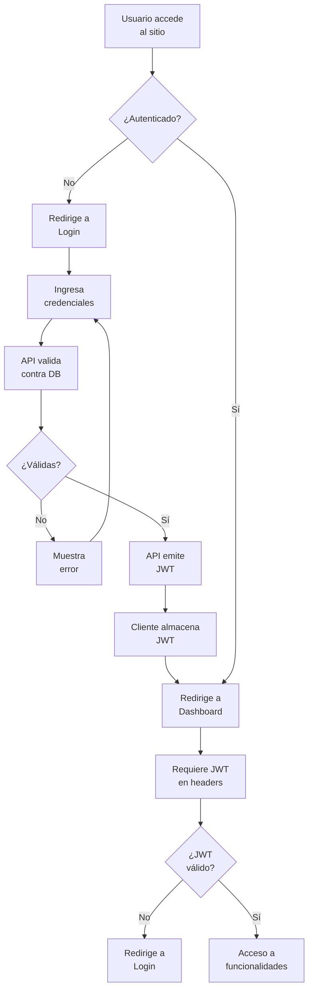
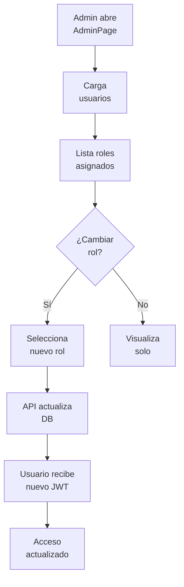

# EP-006 — Administración y Seguridad (JWT)

## Trazabilidad

**Épica**: EP-006 — Administración y Seguridad (JWT)  
**Historias cubiertas**: HU-015 (Inicio de sesión seguro), HU-016 (Gestión de usuarios y roles)  
**Descripción**: Flujos de autenticación con JWT y gestión de roles. Cubre login, validación de tokens y asignación de permisos.

## Flujo: Autenticación y Acceso

## Flujo: Gestión de Roles

