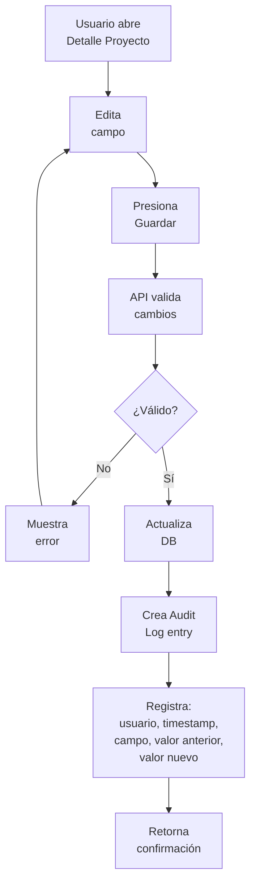
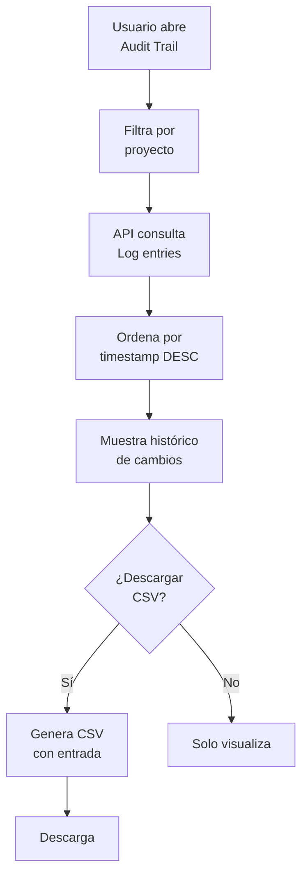
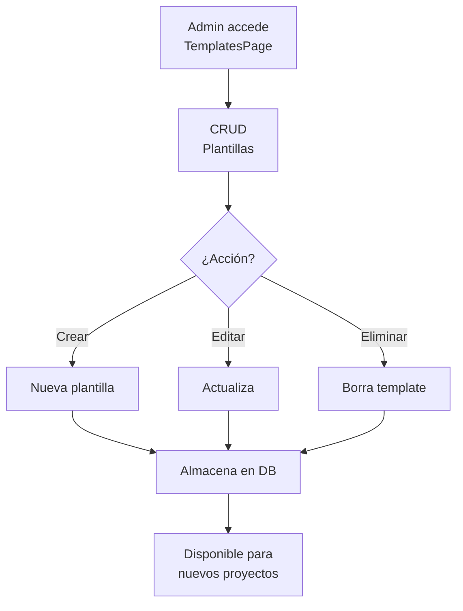

# EP-007 — Trazabilidad y Configuración

## Trazabilidad

**Épica**: EP-007 — Trazabilidad y Configuración  
**Historias cubiertas**: HU-017 (Ver historial de cambios), HU-019 (Gestión de plantillas)  
**Descripción**: Audit Trail para rastrear cambios en proyectos. CRUD de plantillas de proyectos.

## Flujo: Auditoría de Cambios

## Flujo: Consulta de Audit Trail

## Flujo: Gestión de Plantillas

