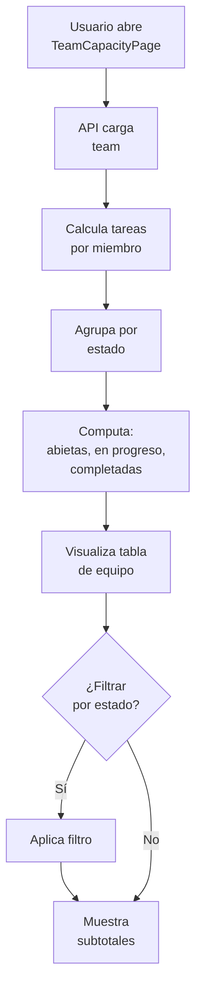
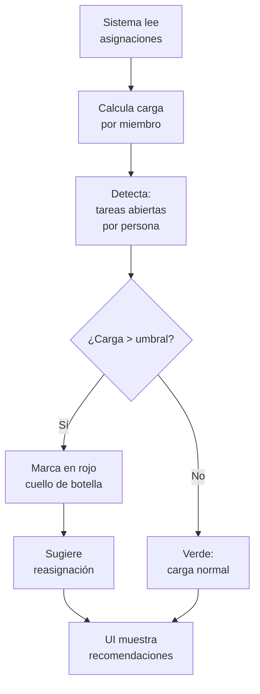

# EP-008 — Vista de Equipo (Team Capacity)

## Trazabilidad

**Épica**: EP-008 — Vista de Equipo (Team Capacity)  
**Historias cubiertas**: HU-018 (Ver capacidad de carga del equipo)  
**Descripción**: Dashboard de carga de trabajo por miembro. Identifica cuellos de botella y disponibilidad.

## Flujo: Visualización de Carga

## Flujo: Identificación de Cuellos de Botella

