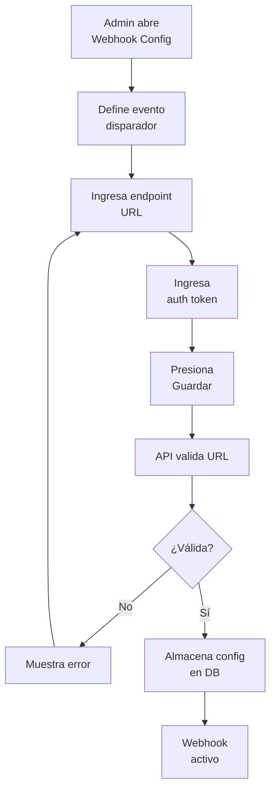
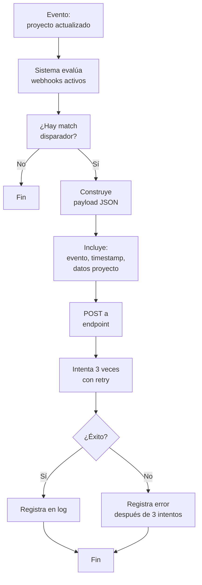
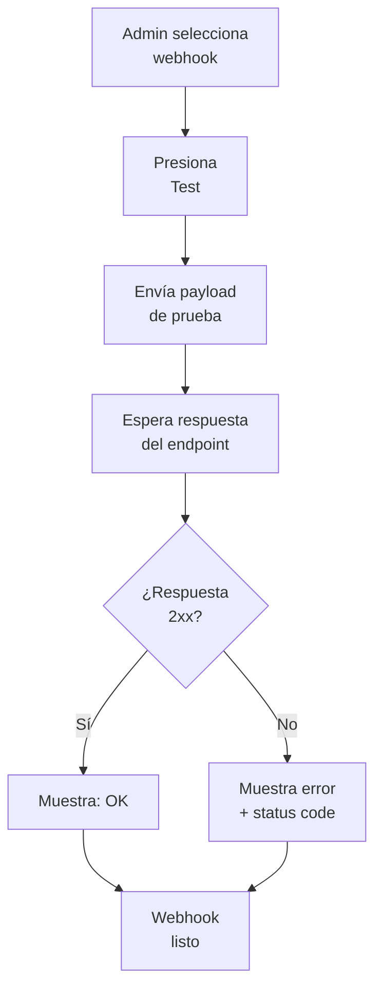

# EP-009 — Integraciones (Webhooks)

## Trazabilidad

**Épica**: EP-009 — Integraciones (Webhooks)  
**Historias cubiertas**: HU-021 (Integración de Webhooks básicos)  
**Descripción**: Configuración y disparo de webhooks hacia sistemas externos. Reintentos automáticos y logging de eventos.

## Flujo: Configuración de Webhook

## Flujo: Disparo de Evento

## Flujo: Testing de Webhook

